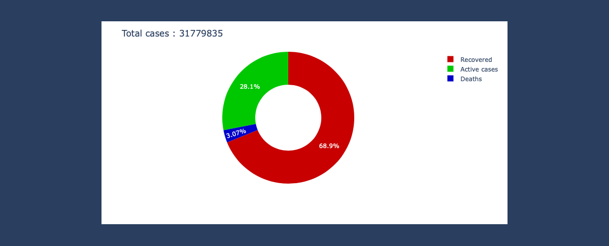

# Covid-19-Analysis

A notebook that carries out analysis on Covid-19 data from the Kaggle. The CSV files uploaded are the files used.

## Usage
#### To launch the notebook:
    $ jupyter notebook
### To run the exercises:
1. Within the Jupyter notebook, find the `Covid-19 Analysis.ipynb` notebook.
2. Press the <kbd>▷</kbd> button to run each cell of the notebook or Shift+Enter.

